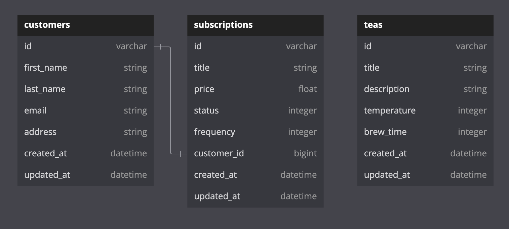

# Tea Subscription API

Welcome to the Tea Subscription Service API documentation. This Rails API provides endpoints to manage customer subscriptions, allowing users to subscribe, cancel, and view subscription details.

## Requirements
- Ruby version: 3.2
- Rails version: 7.1

## Installation
1. Clone the repository:

    ```bash
    git clone <repository_url>
    ```

2. Install dependencies:

    ```bash
    bundle install
    ```

3. Set up the database:

    ```bash
    rails db:setup
    ```

## Usage
- Start the server:

    ```bash
    rails server
    ```

- Access the API endpoints via http://localhost:3000/api/v1/


## Database Schema



## Endpoints

### Subscribe a Customer
- **Endpoint:** `/api/v1/customers/:customer_id/subscriptions`
- **Method:** POST
- **Request Body:**
  ```json
  {
    "title": "Premium Tea Subscription",
    "price": 19.99,
    "frequency": 0
  }
  ```
  * Frequency of subscription is determined by enumerables: 0 -> Weekly, 1 -> Monthly
  * Status of subscription defaults to enum 0 (Active)

- **Response Body:**
  ```json
  {"data":
    {
    "id":"81",
    "type":"subscription",
    "attributes":
      {
        "title":"Premium Tea Subscription",
        "price":19.99,
        "status":"active",
        "frequency":"weekly"
      }
    }
  }
  ```

  ### Cancel a Subscription
- **Endpoint:** `/api/v1/customers/:customer_id/subscriptions/:subscription_id`
- **Method:** DELETE

- **Response Body:**
  - No Content
  - Status 204

  * Subscription is not deleted from database. Rather update Status to 1 (cancelled). This method is known as soft deleting.

  ### View all of a Customer's Subscriptions

- **Endpoint:** `/api/v1/customers/:customer_id/subscriptions`
- **Method:** GET

- **Response Body:**
  ```json
  {
    "data": [
      {
      "id":"88",
      "type":"subscription",
      "attributes":
        {
          "title":"Starter",
          "price":1.5,
          "status":"active",
          "frequency":"monthly"
        }
      },
      {
      "id":"89",
      "type":"subscription",
      "attributes":
        {
          "title":"Gold",
          "price":1.5,
          "status":"cancelled",
          "frequency":"monthly"
        }
      },
      {
      "id":"90",
      "type":"subscription",
      "attributes":
        {
          "title":"Student",
          "price":1.5,
          "status":"cancelled",
          "frequency":"monthly"
        }
      }
    ]
  }

## Testing
This project includes automated tests written with RSpec. To run the tests, execute the following command:

```bash
bundle exec rspec
```
## Error Responses

The API follows a standard error response format for 400-series error codes. For example:

```json
{
    "errors": [
        {
            "detail": "Couldn't find Subscription with 'id'=123123123123"
        }
    ]
}
```

## Contributing
Contributions are welcome! Feel free to open issues or pull requests.

## License
This project is licensed under the MIT License.


